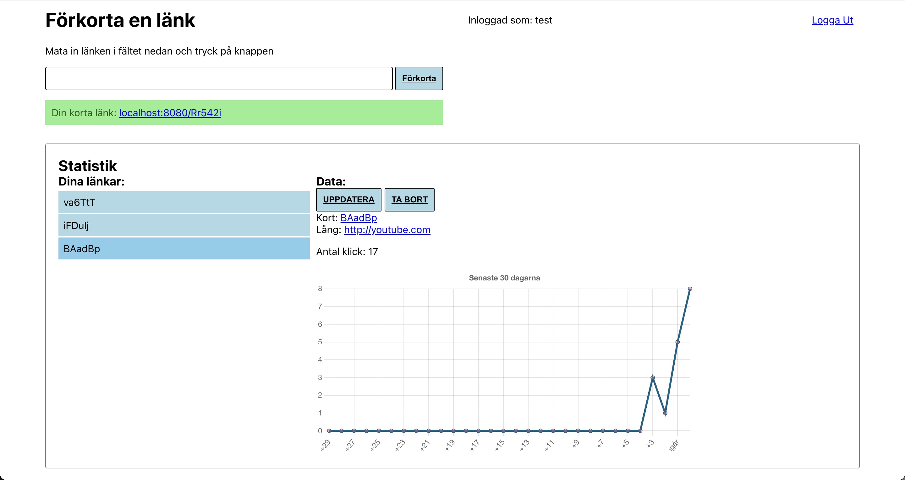

# Förkorta en länk



## Beskrivning

Omvandlar en lång länk till en kortare. Den korta länken omdirigerar användaren och
registrerar även statistik.

Kända exempel är: [bit.ly](https://www.bit.ly) och [t.ly](https://wwww.t.ly).
Projektet använder sig av Go, React och Redis. Använder även chart.js för graf.

## Instruktioner
Starta en redis server genom at köra:
<br/>
`redis-server`

Starta hemsidan genom att köra:
<br/>
```
git clone https://github.com/ineblom/duva_test.git
cd duva_test/frontend
npm install
npm run build
cd ../backend
go run .
```

## Tidsåtgång
Tog totalt ca. 1.5 veckor av programmering på vissa lektioner i skolan och några timmar
på fritiden

Kanske ~8-10 timmar?

## Eventuella förbättringar
- Hanterar inte dag/natt tema eller mindre storlekar
- Statistiken visar endast senaste 30 dagar. Trots att mer sparas. Kan optimeras.
- Vissa ogiltiga länkar tillåts. Kan lösas enkelt. Designfråga.
- Mer statisitk:
  - Klick per dag
  - Tid
  - Plats